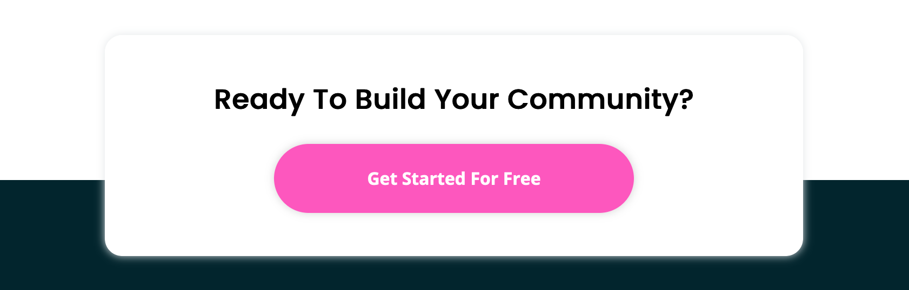
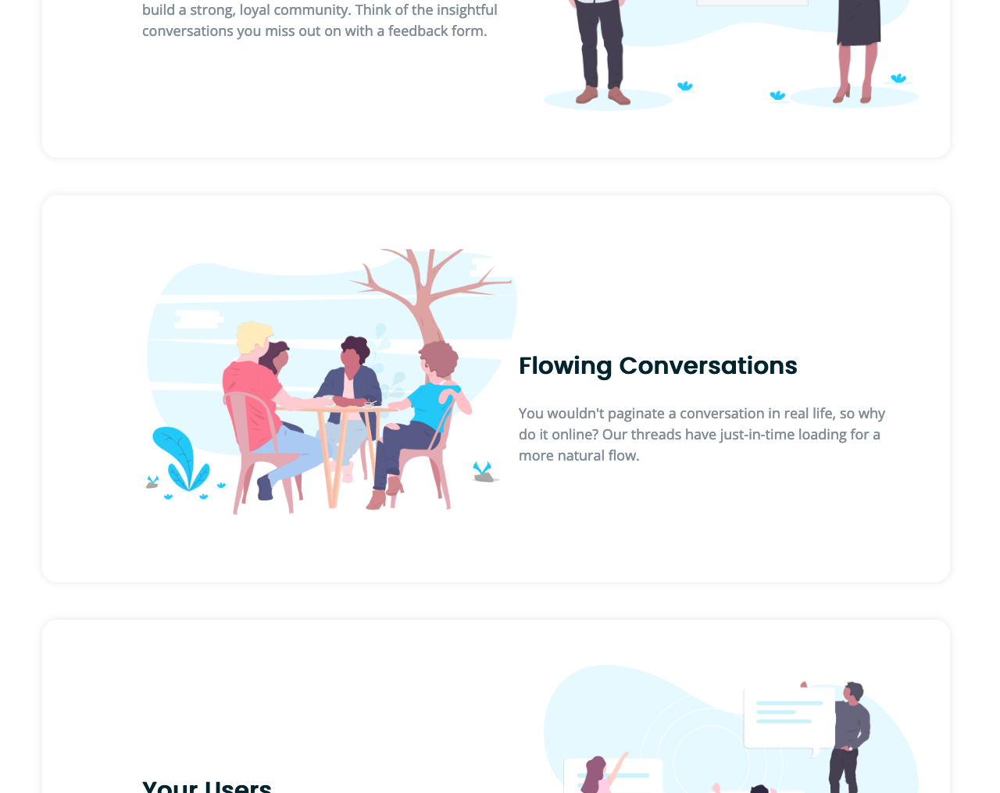

# Landing page with alternating feature blocks solution

This is a solution to the [Huddle landing page with alternating feature blocks challenge on Frontend Mentor](https://www.frontendmentor.io/challenges/huddle-landing-page-with-alternating-feature-blocks-5ca5f5981e82137ec91a5100).
My first time building a whole webpage!

## Overview

### The challenge

Users should be able to:

- View the optimal layout for the site depending on their device's screen size
- See hover states for all interactive elements on the page

### Solution

## My process

### Built with

- Semantic HTML5 markup
- CSS custom properties
- Flexbox
- Mobile-first workflow

### What I learned

- [Website anatomy](https://medium.com/tylergaid/website-design-101-essential-terms-64bc4a52847f) helped me with naming classes and organizing components.

- I recolored a svg image using [this tutorial](https://stackoverflow.com/questions/24224112/css-filter-make-color-image-with-transparency-white).

- [I've arranged components one above another](https://stackoverflow.com/questions/19561585/how-to-make-div-go-behind-another-div) to create this part of the design:

    

- I used this [html color chart website](https://htmlcolorcodes.com/color-chart/) while picking a color for component shadows.

- I also know, [which units to use where](https://gist.github.com/basham/2175a16ab7c60ce8e001).

- And; the titular alternating feature blocks, with a little bit of help on [using the :nth-child pseudo class](https://stackoverflow.com/questions/10930385/how-can-i-get-every-second-element-if-each-is-embedded-in-another-one).

    

### Continued development

- I'm really happy with my css document flow (colors, typography, placement), but I need to get better with dividing between mobile, desktop and common parts of the design.